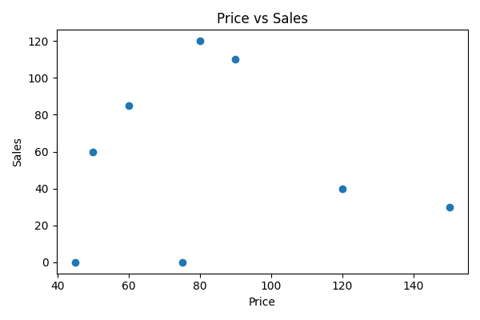
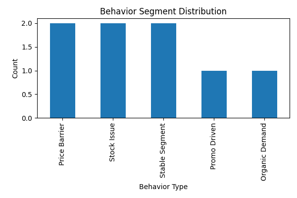
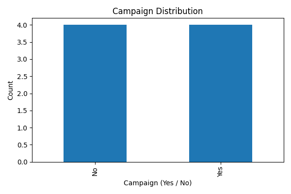
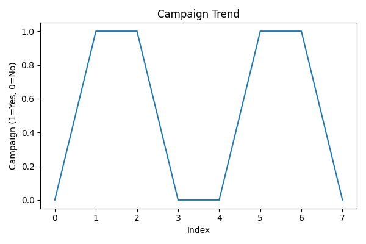
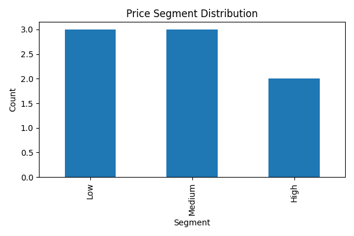
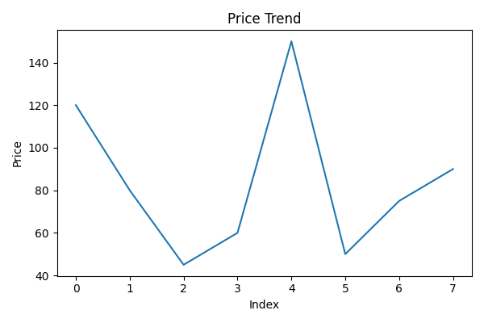
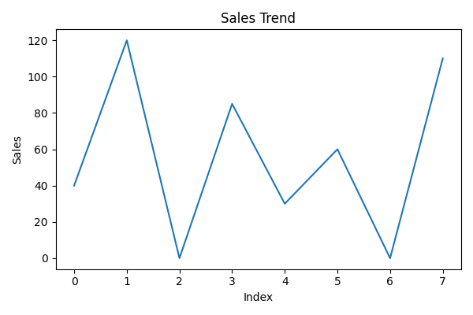
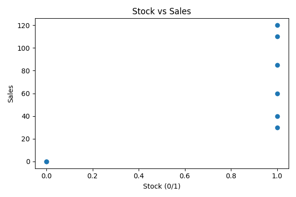
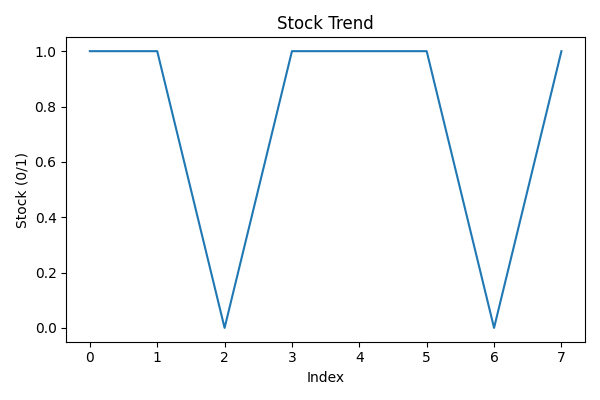

# 📊 Segment Analysis Project  
### Behavioral & Price-Based Sales Segmentation  
(Türkçe & English)
## 📌 Project Preview

### 🔹 Price vs Sales

### 🔹 Behavior Segmentation

### 🔹 Campaign Segment

### 🔹 Campaign Trend

### 🔹 Price Segment

### 🔹 Price Trend

### 🔹 Sales Trend

### 🔹 Stock vs Sales

### 🔹 Stock Segment

### 🔹 Stock Trend

# 📁 Folder Structure / Klasör Yapısı
...
# 📈 Key Insights / Temel Bulgular
...
# 🧠 Segments Defined / Oluşturulan Segmentler
...
# 🛠 Tech Stack
...
# 📄 PDF Report
...
# 🚀 Author
...
# 🎯 Summary (EN/TR)
...

